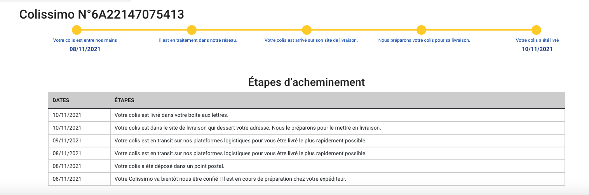

# my-github-profilecard

Display a tracking informations about your Laposte parcels : Lettre suivi, Colissimo, Chronopost



## How to use it in your own projet ?
* npm i vue-laposte-tracking
* import LaposteTracking from 'vue-laposte-tracking'
* ```<LaposteTracking tracking="parcelNumber"/>```
